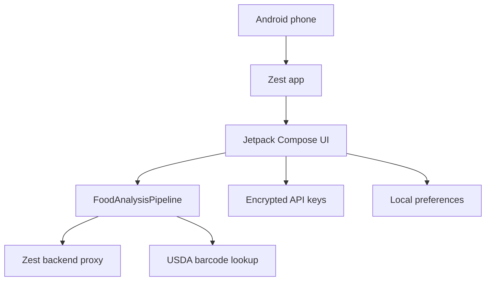
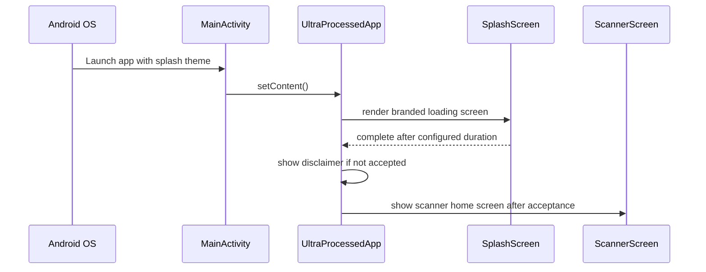
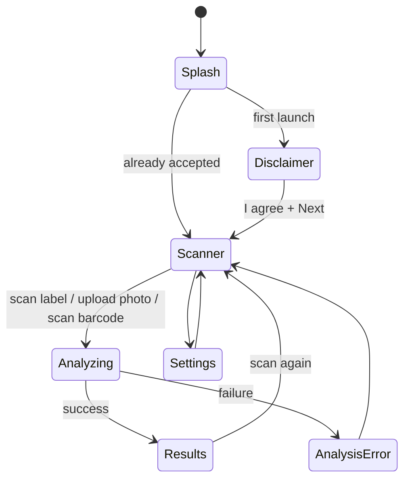
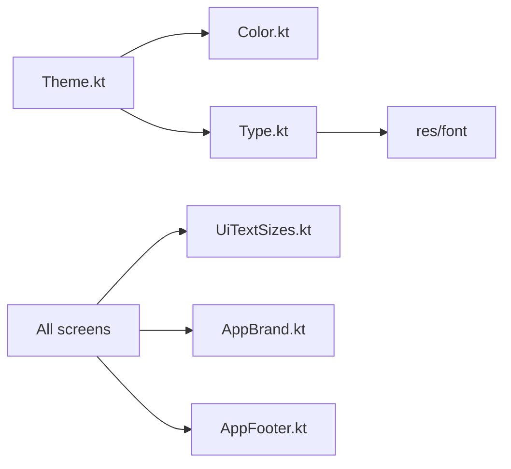
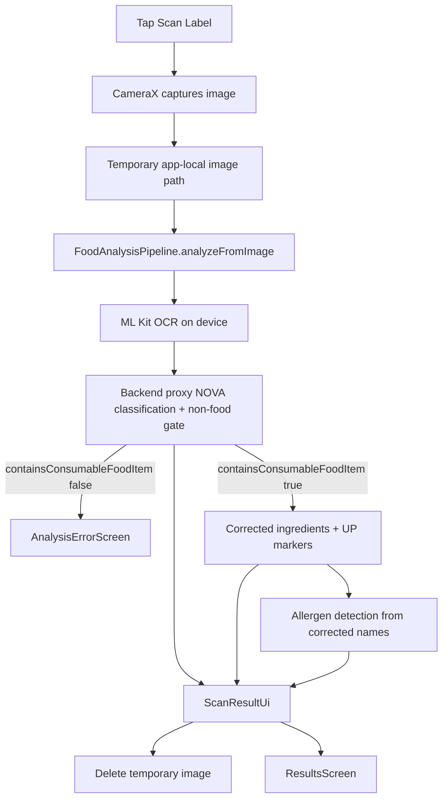
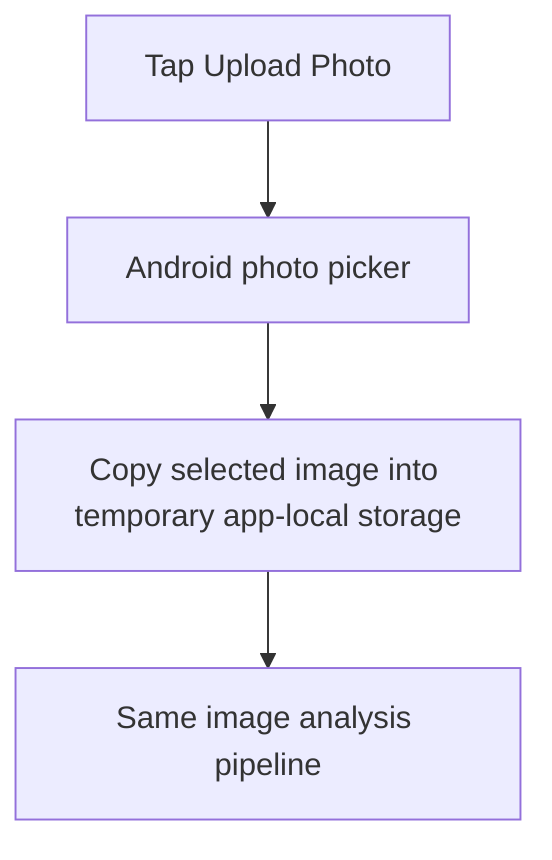
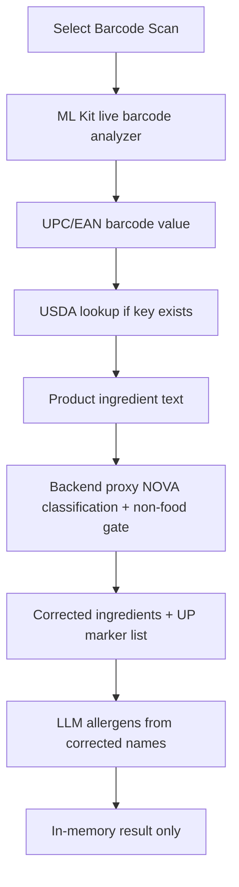
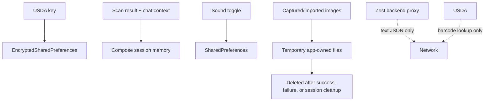

# Android App Guide For Non-Android Developers

This is the fastest way to understand how Zest is built if you are not an Android developer. It explains the project shape, the app startup flow, the UI architecture, and the scan pipeline using plain language and diagrams.

## Big Picture

Zest is a native Android app written in Kotlin with Jetpack Compose. Compose means the UI is code, not XML screens. Each screen is a Kotlin function that renders UI from state and sends user actions back through callbacks.



## What Lives Where

```text
app/
├── build.gradle.kts                  Gradle build, release signing, source guards
├── src/main/AndroidManifest.xml      Android entry metadata, launcher icon, splash theme
├── src/main/java/com/b2/ultraprocessed/
│   ├── ui/                           Compose screens and app shell
│   ├── ui/theme/                     Colors, typography, Material theme
│   ├── ui/audio/                     App sounds and sound playback
│   ├── analysis/                     Scan orchestration and usage estimates
│   ├── camera/                       Camera capture and gallery import
│   ├── barcode/                      Live ML Kit barcode scanning
│   ├── ocr/                          ML Kit OCR fallback interface
│   ├── network/llm/                  Backend proxy calls, retries, result chat
│   ├── network/usda/                 USDA FoodData Central lookup
│   └── storage/                      Encrypted secrets and preferences
└── src/main/res/
    ├── font/                         Inter and Space Grotesk font files
    ├── raw/                          App open, click, success, and error sounds
    ├── drawable/                     Zest mark and launch background assets
    ├── mipmap-anydpi*/               Launcher icon definitions
    └── values*/                      Colors, strings, themes, Android 12 splash attrs
```

## Startup Flow

There are two startup layers:

- Android system splash: shown by the operating system before Compose starts.
- Compose splash: the branded Benevolent Bandwidth and Zest loading screen rendered by app code.



The system splash is configured through:

- `AndroidManifest.xml`
- `res/values/themes.xml`
- `res/values-v31/themes.xml`
- `res/drawable/ic_zest_splash.xml`
- launcher icon resources under `res/mipmap-anydpi*`

The Compose splash is implemented in:

- `ui/SplashScreen.kt`
- `ui/UltraProcessedApp.kt`

## Navigation Model

Zest does not use a large navigation framework yet. The app shell stores a simple destination value and swaps screens with Compose.
System back and Android edge-swipe gestures are intercepted with Compose `BackHandler` in `UltraProcessedApp.kt`. The handler routes back actions within the app instead of letting the Activity close immediately.



The owner of this flow is `ui/UltraProcessedApp.kt`.
The first-run disclaimer is also owned here: `AppPreferences.disclaimerAccepted` decides whether the user sees `DisclaimerScreen` after the splash. Settings can open the same disclaimer screen later.

Current limitation: this is still not a true navigation stack. `UltraProcessedApp` tracks one `destination` plus a lightweight `previousDestination` for Settings and Disclaimer navigation. See [09-todo-roadmap.md](09-todo-roadmap.md) for the centralized navigation stack v2 task.

## How Compose Screens Work Here

A screen file usually has three responsibilities:

- Receive state from `UltraProcessedApp`.
- Render UI using project typography, colors, spacing, and shared components.
- Send user actions back through callbacks.

Example mental model:

```text
UltraProcessedApp owns state
        │
        ▼
ScannerScreen renders current state
        │
        ▼
User taps Scan Label
        │
        ▼
ScannerScreen calls onScan(path)
        │
        ▼
UltraProcessedApp moves to Analyzing
```

This keeps screens mostly display-focused and keeps navigation, session state, and provider wiring in one place.

## UI System

The current visual system uses:

- Dark app background.
- Zest green as the primary action and brand color.
- Inter for most UI text.
- Space Grotesk for brand-forward titles and compact labels.
- An 8pt spacing grid for margins and padding.
- A 1.25-ish type scale centralized in `ui/UiTextSizes.kt`.
- Shared brand mark rendering in `ui/AppBrand.kt`.



If you change text sizes, colors, or the brand logo, start in these shared files instead of changing one screen at a time.

## Scan Flows

### Ingredient Label Scan



### Uploaded Photo



### Barcode Scan



The primary scanner button changes from `Scan Label` to `Scan Barcode` when barcode mode is selected.

## Data And Privacy



Important boundaries:

- AI model keys are not entered or stored in the Android app.
- USDA API keys are never committed, logged, or shown back in plain text.
- Scan history is not stored; the retired Room/history code lives only in `documentation/code-archive/session_only_storage/`.
- Captured images are temporary files and are deleted after success, failure, or session cleanup.
- Sound preferences are local app settings.
- The backend and model provider receive extracted text JSON, not captured or uploaded images.
- The NOVA stage rejects non-food/non-ingredient scans with `containsConsumableFoodItem = false`; the app shows the returned human-readable reason instead of forcing later stages to fail.
- USDA receives barcode/product lookup requests only when USDA access is configured.

## Build System

Gradle is the Android build tool. The active app does not use Room or KSP.

Common commands:

```bash
./gradlew :app:verifySourceTreeForBuild
./gradlew :app:compileDebugKotlin
./gradlew :app:testDebugUnitTest
./gradlew :app:assembleDebug
./gradlew :app:compileReleaseKotlin
./gradlew :app:minifyReleaseWithR8
```

The build includes guard tasks that run before Android builds:

- `verifyNoRetiredSourceFiles` blocks retired demo, legacy, or rule-based classifier files from reappearing.
- `verifyNoDatalessSources` blocks macOS dataless source placeholders that can make Gradle or KSP hang.
- `verifySessionOnlyStorage` blocks archived Room/history code or active persistence wiring from returning to `src/main`.
- `verifySourceTreeForBuild` runs all source-tree checks.

## Safe Change Checklist

Use this checklist before handing a change to someone else:

1. If you changed UI, confirm the screen uses shared typography, colors, spacing, and brand assets.
2. If you added text, put reusable user-facing strings in resources when appropriate.
3. If you added images, fonts, sounds, or icons, keep them under `app/src/main/res`.
4. If you touched analysis contracts, update `documentation/08-llm-api-contracts.md`.
5. If you touched session data, file cleanup, or privacy behavior, update `documentation/06-storage-security.md`.
6. If you touched release behavior, update `documentation/07-testing-release.md`.
7. Run at least `./gradlew :app:verifySourceTreeForBuild :app:compileDebugKotlin`.

## Where To Start For Common Tasks

| Task | Start here |
| --- | --- |
| Change the scanner home screen | `ui/ScannerScreen.kt` |
| Change result chips or allergen sections | `ui/ResultsScreen.kt` |
| Change settings | `ui/SettingsScreen.kt` |
| Change logo usage | `ui/AppBrand.kt` and `res/drawable/ic_zest_*.xml` |
| Change fonts or type sizes | `ui/theme/Type.kt` and `ui/UiTextSizes.kt` |
| Change analysis behavior | `analysis/FoodAnalysisPipeline.kt` |
| Change LLM prompts | `backend/prompts/` |
| Restore archived history intentionally | `documentation/code-archive/session_only_storage/` and `documentation/06-storage-security.md` |
| Plan v2 engineering/product work | `documentation/09-todo-roadmap.md` |
