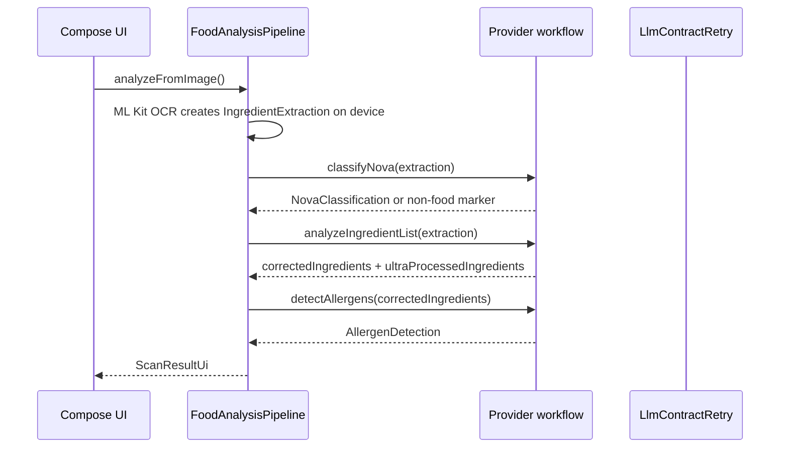
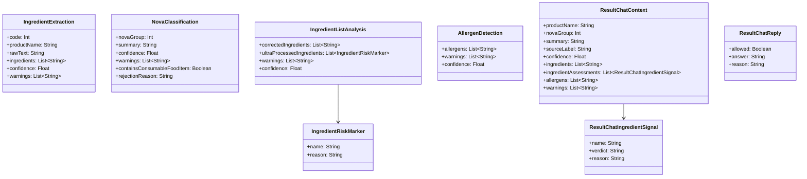

# LLM API Contracts

This document is the source of truth for every model-backed call in Zest. It covers:

- the backend proxy request flow,
- the exact output classes the app expects,
- deterministic request parameters,
- and the retry behavior that keeps malformed responses out of the UI.

The runtime is API-only for analysis and result chat. The app does not use rule-based classification as a production fallback, and Android does not send analysis prompts or schemas.

Usage and cost values shown in the active result use provider usage metadata when the API response includes it. OpenAI-compatible responses read `usage.prompt_tokens`, `usage.completion_tokens`, and `usage.total_tokens`; Gemini responses read `usageMetadata.promptTokenCount`, `usageMetadata.candidatesTokenCount`, and `usageMetadata.totalTokenCount`. If a provider omits usage metadata, the app falls back to the local estimate. These values are never persisted.

## Files

- `network/llm/FoodLabelLlmWorkflow.kt`
- `network/llm/ProxyFoodLabelLlmWorkflow.kt`
- `network/llm/ProxyResultChatWorkflow.kt`
- `network/llm/ResultChatWorkflow.kt`
- `backend/prompts/food_label_full_analysis_prompt.md`
- `backend/prompts/food_label_result_chat_prompt.md`

## Call Map

| Stage | Input | Output | Notes |
| --- | --- | --- | --- |
| Full analysis | OCR/USDA ingredient text | `NovaClassification`, `IngredientListAnalysis`, `AllergenDetection` | One backend `/analyze` call. Backend prompt internally orders food gate, cleaned ingredients, markers, allergens, then NOVA. |
| Result chat | `ResultChatContext` + user question + history | `ResultChatReply` | One backend `/chat` call. Scopes questions to the current scan only. Rejects injection and off-topic prompts. |

## Transport Layer

### Gemini

Gemini workflows call:

`POST https://generativelanguage.googleapis.com/v1beta/models/{modelId}:generateContent`

Headers:

- `x-goog-api-key: <api key>`

Request shape:

- `contents[0].parts[]` contains text only. Zest never sends images to Gemini.
- `generationConfig.responseMimeType` is `application/json`.
- `generationConfig.temperature` is `0.0`.
- `generationConfig.topP` is `1.0`.

### OpenAI-Compatible Providers

OpenAI-compatible workflows call:

`POST {baseUrl}/chat/completions`

Headers:

- `Authorization: Bearer <api key>`

Request shape:

- `messages[0].role = "user"`
- `messages[0].content` contains the prompt plus the input JSON.
- `response_format.type = "json_object"`
- `temperature` is `0.0`.
- `top_p` is `1.0`.
- `frequency_penalty` is `0.0`.
- `presence_penalty` is `0.0`.

## Request Flow

## Expected Output Classes

## Stage Contracts

### IngredientExtraction

Purpose:
- carry OCR/USDA text evidence into LLM stages,
- keep image handling outside provider workflows,
- and provide rough ingredient tokens from local normalization.

Required fields:
- `code`: currently `0` for pipeline-created extraction.
- `productName`: visible product name only when it is clearly present.
- `rawText`: best-effort transcription of the ingredient panel.
- `ingredients`: atomic ingredient tokens in reading order.
- `confidence`: 0.0 to 1.0.
- `warnings`: OCR or crop quality notes.

Important rules:
- do not infer ingredients from product name or packaging art,
- do not return long sentence-like ingredient clauses,
- do not treat `Contains:` or `May contain` strings as ingredients.

### NovaClassification

Purpose:
- classify the whole label with a single NOVA group,
- reject non-food/non-ingredient text before later API stages run,
- and provide a concise one-liner summary.

Required fields:
- `containsConsumableFoodItem`: boolean
- `novaGroup`: 1..4 for food scans, `0` for non-food rejection
- `summary`: consumer-readable classification summary
- `rejectionReason`: human-readable reason when `containsConsumableFoodItem` is false
- `confidence`: 0.0 to 1.0
- `warnings`: OCR or uncertainty notes

Non-food behavior:
- if `containsConsumableFoodItem` is false, the pipeline stops,
- ingredient cleanup and allergen detection are skipped,
- `AnalysisErrorScreen` shows `rejectionReason` inside its `AI response` container.

### IngredientListAnalysis

Purpose:
- correct ingredient names for display,
- return the subset of corrected ingredients that are ultra-processed or industrial formulation markers,
- drive red/green ingredient capsule coloration.

Required fields:
- `correctedIngredients`: short ingredient names in source order
- `ultraProcessedIngredients`: marker objects whose `name` must exactly match an item from `correctedIngredients`
- `warnings`: uncertainty/input-quality notes
- `confidence`: 0.0 to 1.0

Capsule rules:
- red if the corrected name appears in `ultraProcessedIngredients`,
- green otherwise,
- no rule-based color fallback.

### AllergenDetection

Purpose:
- identify explicit allergen signals only,
- keep the allergen block separate from NOVA ingredient coloring.

Required fields:
- `allergens`: standalone allergen names only
- `warnings`: OCR or ambiguity notes
- `confidence`: 0.0 to 1.0

Important rules:
- do not infer allergens from product name,
- do not infer from shared-facility claims unless the text explicitly says so,
- normalize clause-like text into atomic allergen names if possible,
- use corrected ingredient names, not raw OCR text.

### ResultChatReply

Purpose:
- answer questions about one scan result only,
- refuse injection attempts,
- and reject off-topic questions.

Required fields:
- `allowed`: boolean gate for whether the answer is permitted
- `answer`: the user-facing answer when allowed
- `reason`: why a response was denied or constrained

## Validation Prompt

The production analysis path is backend-owned: Android sends OCR/product input to `/analyze`, and the backend uses `food_label_full_analysis_prompt.md` plus Gemini structured output to return NOVA, ingredient, and allergen sections in one response. Android does not send prompt text or response schemas.

The production result-chat path is also backend-owned: Android sends the current result context, user question, and in-session chat history to `/chat`, and the backend uses `food_label_result_chat_prompt.md` to produce a `ResultChatReply`. Chat payloads sent to `/analyze` are rejected.

If validation is reintroduced, it must stay text-only, must not invent ingredients, and must be documented here with exact call order.

## Retry Semantics

The shared retry helper in `LlmContractRetry.kt` enforces:

- one contract attempt in the current code (`LLM_CONTRACT_RETRY_ATTEMPTS = 1`),
- no schema repair loop unless that constant and call sites are intentionally changed,
- user-safe failure messages for malformed provider responses.

Timeout retries happen at the pipeline stage level:

- `runLlmStage` wraps each LLM call in `withTimeout`,
- `LLM_TIMEOUT_RETRY_ATTEMPTS = 2`,
- timeout failures are retried, then surfaced as a stage-specific timeout message.

Contract violations that trigger retries include:

- missing required fields,
- invalid JSON,
- unsupported codes or NOVA groups,
- incomplete objects,
- unusable ingredient lists,
- malformed sentence-like ingredient or allergen strings.

If all retries fail:

- the API layer throws a user-safe message,
- the UI should not display raw schema field names,
- the analysis screen should show a generic parse failure or the API-readable rejection reason when the model explicitly marks the scan as non-food.

## Provider Notes

### Image handling

- Captured and uploaded label images stay on device.
- ML Kit OCR creates ingredient text locally.
- Provider workflows only receive OCR/USDA text JSON.

### Result chat

- uses the current scan result as locked context,
- calls backend `/chat`, not `/analyze`,
- does not allow general conversation,
- refuses prompt injection before the model is called when possible,
- still validates the final JSON reply.

## Adding Another Provider

To add a new direct provider path, implement:

- `FoodLabelLlmWorkflow`
- `ResultChatWorkflow`

Then ensure:

- it is explicitly selected by product policy instead of silently bypassing the backend proxy,
- it does not receive prompt text from Android unless the BYOK/direct-provider feature is intentionally restored,
- it respects deterministic request parameters,
- it uses timeout-only retries unless contract retry behavior is deliberately expanded,
- it returns the same output classes listed above.

## Operational Rule

If a payload cannot be parsed or validated, the user should see a clean analysis failure state or a retry/fallback message, not the raw model error text.

## UI Contract Notes

- Ingredient chip text should come from atomic ingredient names only.
- Allergen strings should be atomic allergen names only.
- Result chat is labeled as chat about the current scan and should stay scoped to that scan.
- Active-result cost and token display should use exact provider usage metadata when available, with local estimates only as a fallback for providers that omit usage. No history rows are created.
